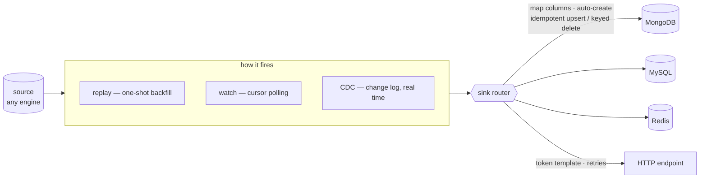
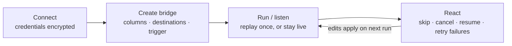

<div align="center">

<picture>
  <source media="(prefers-color-scheme: dark)" srcset="apps/web/public/logo-white.png">
  
</picture>

### Keep any databases in sync — live, across engines.

Connect your databases, draw a **bridge** from a source to one or more
destinations, and Syncle keeps them in sync: the moment a row changes in the
source, it's written to every destination you linked. Any engine to any engine —
**PostgreSQL · MySQL · SQLite · MongoDB · Redis** — plus HTTP endpoints
when you need them.

<sub>A bridge is just: a source → one or more destinations → kept in sync.</sub>

<br>

[](LICENSE)
[](https://github.com/osmanahmadxai/SYNCLE/discussions)


<br>


</div>

---

## What it does

A **bridge** reads rows from a source database and writes each one to its
**destinations**. A destination is either:

- **another database** — the headline feature. Sync Postgres → MongoDB,
  MySQL → SQLite, MongoDB → Redis… mix engines freely. One bridge can fan out to
  **several databases at once**, and bridges can chain (DB&nbsp;A → DB&nbsp;B → DB&nbsp;C).
- **an HTTP endpoint** — POST/PUT/PATCH each row to a URL with a payload you
  design, for the times you're feeding a service instead of a database.



What makes the database-to-database sync trustworthy:

- **Any engine → any engine.** The same bridge moves a row between relational,
  document, and key-value stores. Values are translated to fit the target.
- **No duplicates, ever.** Writes are **idempotent upserts** keyed by the columns
  you choose, so replays, retries, and redeliveries never double-write. Inserts,
  updates, **and deletes** all propagate.
- **Missing table? Auto-create it.** If the destination table/collection doesn't
  exist, Syncle creates it from the source's shape (with cross-engine type
  translation). Or **map and rename columns** yourself — "write this column into
  that column over there."
- **Live, polled, or one-shot** — you pick how it fires (see triggers below).

### How a bridge fires

- **Replay** — a one-shot job. Stream all (or selected) rows once, then finish.
  Perfect for the **initial backfill** or a migration.
- **Watch** — poll the source on a cursor (an auto-increment id, an `updated_at`
  column, or a primary-key diff) and sync new rows as they show up. Works on
  every engine.
- **CDC** — true change-data-capture straight from the database's change log, in
  **real time, no polling**. Postgres logical replication, MySQL binlog, MongoDB
  change streams, Redis keyspace notifications. Inserts, updates, and deletes all
  come through, each tagged with its operation.

The rest is the same whichever destination and trigger you pick:

- **Build it visually.** Browse the source table, toggle the columns to send,
  pick destinations, and watch a live preview of exactly what will be written.
- **Map or shape the data.** For a database target, map source → target columns
  (rename, drop, pick keys). For an HTTP target, use a safe token template —
  `{{column}}`, `{{$row}}`, `{{$table}}`, `{{$op}}`, `{{$now}}`, `{{$index}}`.
  Structured substitution only — no string injection, no code execution.
- **Sync reliably.** Retries with backoff, rate limiting, optional batching, and
  exactly-once delivery so a change is applied once and only once downstream.
- **Watch it happen.** A live timeline colours every delivery green (synced) ·
  red (failed) · amber (skipped) · slate (queued). Click any cell for the exact
  row written, the result, timing, and any error.
- **Stay in control.** Jobs survive restarts, resume where they stopped, and can
  be cancelled. Skip rows by range or selection, or retry only the failed ones in
  place — failed cells flip green.

### See it happen


<sub><b>A bridge built seconds earlier, delivering.</b> Orders are inserted into Postgres from outside the browser while the page is open, so the counter climbing is the bridge doing the work — no cuts, nothing sped up. The <a href="https://syncle.dev/#demo">full 58-second walkthrough</a> (plays on syncle.dev; <a href="https://raw.githubusercontent.com/osmanahmadxai/SYNCLE/main/website/public/media/syncle-demo.mp4">the file</a> downloads, 3.6&nbsp;MB) builds this bridge from an empty workspace — naming it, picking the source table, choosing event-based CDC, pointing it at MongoDB — with the mouse visible throughout. More stills in <a href="docs/assets/media">docs/assets/media</a>.</sub>


<sub>A CDC bridge mid-flight, and every row that crossed it — what was written, when, and how long it took.</sub>


<sub>A finished backfill. Deliveries can exceed the total because rows kept changing at the source while the replay ran — the upserts are idempotent, so they land once.</sub>

---

## Get started

### Install and run — one command

```bash
curl -fsSL https://syncle.dev/install | sh -s -- up
```

That's the whole thing. It downloads the newest release, starts Syncle, and
opens it at **http://localhost:3002**. Docker is the only requirement — Node,
Postgres and Redis all run in containers, and the app image is pulled prebuilt,
so nothing is compiled on your machine.

On first run it opens the setup form with a one-time **setup token** already
filled in, so all you do is pick a username and password. The token proves you
are the operator of this machine — it is read off the server by `syncle up`,
never typed. If you're setting up from another device, `syncle logs api` prints
it and the form accepts it by hand.

After that, the `syncle` command manages the stack:

```bash
syncle up        # start (and open the GUI)
syncle down      # stop, keeping your data
syncle logs      # follow the logs
syncle update    # move to the newest release
syncle uninstall # remove everything, including data
```

Run the GUI on a different port with `SYNCLE_PORT=8080 syncle up`. Config and
your encryption key live in `~/.syncle`.

<details>
<summary>Prefer plain Docker Compose?</summary>

```bash
curl -fsSLO https://raw.githubusercontent.com/osmanahmadxai/SYNCLE/main/docker-compose.app.yml
docker compose -f docker-compose.app.yml up -d
```

Set `SYNCLE_MASTER_KEY` first (`openssl rand -base64 32`) — it encrypts stored
database credentials. Without it the API generates one inside the data volume,
where it is lost if the volume is removed.

</details>

---

### Run from source (for development)

You'll need **Node 22+**, **pnpm 10+**, and **Docker**. The repo pins both via
`.nvmrc` and `packageManager`, so the easiest setup is:

```bash
nvm use            # picks up Node 22 from .nvmrc (or just use Node 22+ yourself)
corepack enable    # gives you the exact pnpm version the repo expects
```

Then:

```bash
pnpm install                  # frontend + backend
docker compose up -d          # postgres (metadata) + redis (job queue)
pnpm start                    # initialize and run the whole app
```

`pnpm start` does the boring parts for you: it writes the local env files,
builds the workspace, runs the database migrations, then launches both the API
and the web app.

```
  Syncle · ready

    Web  http://localhost:3002   ← open this
    API  http://localhost:4002/api
```

Working on the code? `pnpm dev` is the same thing in watch mode.

> **Install trouble?** `better-sqlite3` is the only dependency that needs a
> native binary. On Node 22+ it installs a prebuilt one — no compiler needed.
> If you see it fall back to `node-gyp` (or a `tsc: command not found` right
> after, which just means the install bailed early), you're usually on a Node
> version without a prebuild or a distro-packaged pnpm with a broken node-gyp.
> Fix: use Node 22+ (`nvm use`), get pnpm via `corepack enable` instead of your
> system package manager, then `pnpm install` again.

> The two services back different things. **Postgres** holds Syncle's own
> metadata (saved connections, bridges, jobs, deliveries) through Prisma.
> **Redis** backs the BullMQ queue that runs bridge jobs durably. Connecting
> databases, browsing data, and building/previewing bridges all work without
> Redis — only _running_ a job needs it. Point `DATABASE_URL` / `REDIS_URL` at
> your own instances if you'd rather not use the bundled containers.

---

## How to use — your first bridge in five minutes

A quick tour from zero to a live sync. All of it happens in the web app at
`http://localhost:3002`.

**1 · Connect your databases.** Open **Data sources** and add the source and
destination connections (host, port, credentials — they're encrypted at rest).
The connection form adapts to the engine you pick, and a connectivity check
tells you immediately whether Syncle can reach it.

**2 · Pick the table you want to sync.** Browse the source connection and open
the table. You get the full workbench view — filter, sort, poke around. When it
looks right, hit **Create bridge**: the builder opens pre-seeded with that table
as the source.

**3 · Shape what gets sent.** Toggle the columns to include, then add one or
more destinations:

- **Database destination** — pick a connection and either map columns onto an
  existing table (rename, drop, choose the upsert keys) or let Syncle
  auto-create the target table from the source's shape, types translated for
  the target engine.
- **HTTP destination** — set the URL/method and design the payload with tokens
  like `{{column}}`, `{{$row}}`, `{{$op}}`, `{{$now}}`.

The live preview shows exactly what will be written before anything runs.

**4 · Choose the trigger.**

| You want…                              | Pick       | What happens                                            |
| -------------------------------------- | ---------- | ------------------------------------------------------- |
| A one-time copy / initial backfill     | **Replay** | Streams all (or selected) rows once, then finishes      |
| Ongoing sync, zero source config       | **Watch**  | Polls a cursor (id / `updated_at` / PK diff) for change |
| Real-time sync straight from the log   | **CDC**    | Live change capture — inserts, updates, deletes         |

For CDC, the builder runs a **readiness check** against the source and lists
anything the database still needs (see [CDC prerequisites](#cdc-prerequisites)).

**5 · Run it and watch.** Start the bridge and the timeline lights up cell by
cell — green synced · red failed · amber skipped · slate queued. Click any cell
to see the exact row, the result, and timing. Fix a destination and **retry just
the failures**, skip rows you don't want, or cancel and resume later — jobs
survive restarts.

> **Common first bridges:** Postgres → MongoDB (replay to backfill, then CDC to
> stay live) · MySQL → SQLite (portable local copy) · MongoDB → Redis (hot
> cache) · anything → HTTP (feed a webhook).

---

## The bridge lifecycle



1. **Connect** your databases (credentials encrypted at rest) from the Data
   sources workbench, or inline while building a bridge.
2. **Create a bridge** — pick the source table and columns, then choose where it
   syncs: one or more **target databases** (map columns or let it auto-create the
   table) and/or an **HTTP endpoint**. Pick a trigger (replay / watch / CDC). For
   CDC the builder runs a readiness check and tells you exactly what (if anything)
   the source still needs configured.
3. **Run / listen** — a replay job streams rows once with the timeline updating
   live; a watch or CDC bridge starts listening and syncs changes as they happen.
4. **React** — skip rows you don't want, cancel, resume the remainder, or retry
   the failures after fixing a destination. Edits apply on the next run/resume.

---

## Source data, when you need it

Syncle ships a full database workbench (the "Data sources" surface) — handy
for shaping a source and for inspecting what landed in a destination:

- Browse any table — paginated, sortable, multi-condition filters, inline edit,
  insert/delete, CSV/JSON export.
- A Monaco query editor with tabs, autocomplete, and formatting.
- Schema explorer, structure view, interactive ER diagram, and full DDL
  (create/drop/truncate tables, create/drop databases).
- Backup & restore — portable JSON for any engine, or `.sql` for relational ones.

Every table view has a one-click "Create bridge" that drops you into the builder
pre-seeded with that table as the source.


<sub>Browsing a source table, and the same database as an ER diagram. <a href="docs/assets/media">The query editor and structure views are here too.</a></sub>

---

## How it's built

A pnpm monorepo with a one-way dependency flow (`web → api → core`):

```
syncle/
├─ packages/
│  └─ core/            @syncle/core — framework-agnostic domain (pure TS)
│     ├─ adapters/       DatabaseAdapter interface + one file per engine
│     │                  (raw drivers: pg, mysql2, better-sqlite3, mongodb, ioredis)
│     └─ bridges/        column mapping + cross-engine table translation,
│                        payload transform, shared bridge schemas (Zod)
├─ apps/
│  ├─ api/             @syncle/api — NestJS backend
│  │  ├─ bridges/        bridge store · job processor · CDC providers ·
│  │  │                  sink router → database sink + HTTP delivery
│  │  ├─ connections/    Prisma-backed store · live adapter pool · controllers
│  │  ├─ common/         crypto · Zod validation · exception filter
│  │  └─ prisma/         metadata-store schema + migrations
│  └─ web/             @syncle/web — Next.js 15 frontend (shadcn/ui, TanStack)
└─ docker-compose.yml  Postgres (metadata) + Redis (job queue)
```

**One sink, two destination kinds.** Every trigger (replay, watch, CDC) funnels
rows through a single sink router. It dispatches to the **database sink** (which
maps columns, auto-creates the target if needed, and performs a native upsert or
keyed delete on the target engine) or to **HTTP delivery** (template render +
POST with retries). The runner, monitor, and exactly-once accounting don't care
which — so a new destination is one module.

**Exactly-once, cross-engine.** Database targets write with the engine's own
atomic upsert — Postgres/SQLite `ON CONFLICT`, MySQL `ON DUPLICATE KEY`, Mongo
`updateOne(upsert)` — keyed by the columns you chose. That makes every write
idempotent: replays and at-least-once CDC redeliveries land a row once. Deletes
route to a keyed delete on each target.

**Durable jobs.** A replay job is one BullMQ queue entry (the queue id is the
job's id). It streams
the source a page at a time (keyset pagination for millions of rows), syncs
sequentially (natural backpressure), and checkpoints progress — so a crash
auto-resumes from where it left off.

**CDC behind one interface.** Each engine captures changes its own way, but they
all implement the same small `CdcProvider` contract (readiness, provision,
stream, cursor). The service around them handles the job lifecycle and the
shared dedupe → map → write → record → checkpoint pipeline, so adding a new
engine's CDC is a single file.

**Two data layers, two right tools.** The databases you connect _to_ have
unknown, runtime-discovered schemas, so the adapters use raw drivers with fully
parameterized queries (an ORM can't introspect arbitrary schemas). Syncle's
_own_ store has a fixed schema we control, so it uses Prisma with migrations.

> Adding an engine = implement `DatabaseAdapter` and register it. The connection
> form, schema browser, and feature gating all derive from that one registration.

---

## Configuration

Env files are created automatically on first run from the committed
`*.env.example` files. The essentials:

| Variable                      | Where | Purpose                                      |
| ----------------------------- | ----- | -------------------------------------------- |
| `PORT`                        | api   | API port (default `4002`)                    |
| `WEB_PORT`                    | web   | Web port (default `3002`)                    |
| `NEXT_PUBLIC_API_URL`         | web   | Base URL of the API                          |
| `DATABASE_URL`                | api   | Postgres datasource for the metadata store   |
| `REDIS_URL`                   | api   | Redis backing the bridge-job queue           |
| `SYNCLE_MASTER_KEY`       | api   | base64 32-byte key for secret encryption     |
| `SYNCLE_JOB_CONCURRENCY` | api   | How many bridge jobs may execute in parallel |
| `WEB_ORIGIN`                  | api   | CORS origin (defaults to any in dev)         |

If `SYNCLE_MASTER_KEY` is unset, a random key is generated under
`apps/api/.syncle/` on first run — set it explicitly in production
(generate one with `openssl rand -base64 32`).

### Remote databases (SSH tunnels)

A connection can reach its database through an SSH jump host: toggle **SSH
tunnel** in the connection dialog and give it the SSH host, user, and either a
password or a PEM private key (plus its passphrase, if it has one). Syncle
opens the tunnel server-side and port-forwards to the database, so only the
SSH port needs to be reachable — the database itself stays private. SSH
credentials are encrypted at rest and returned redacted, exactly like
connection passwords. Tunnels apply to the network engines (PostgreSQL, MySQL,
MongoDB, Redis); SQLite is a local file and never tunnels.

## CDC prerequisites

Replay and watch bridges work anywhere. CDC needs the **source** database
configured for change capture; the builder's readiness panel checks all of this
for you and spells out what's missing.

| Engine     | Mechanism              | What it needs                                                                                               |
| ---------- | ---------------------- | ----------------------------------------------------------------------------------------------------------- |
| PostgreSQL | logical replication    | `wal_level=logical`, a role with REPLICATION (slot/publication auto-made)                                   |
| MySQL      | binary log             | `log_bin=ON`, `binlog_format=ROW`, `binlog_row_image=FULL`, REPLICATION grants, `binlog_transaction_compression=OFF` |
| MongoDB    | change streams         | a replica set (a single-node one is fine for dev); pre-images auto-enabled so deletes propagate by your key |
| Redis      | keyspace notifications | `notify-keyspace-events` (Syncle enables it when it can)                                               |
| SQLite     | —                      | not supported; use a watch bridge instead                                                                     |

> Redis CDC is real-time only and non-durable — events that happen while Syncle
> is offline can't be recovered, so prefer a watch bridge there if you need
> guarantees.

**MySQL specifics.**

- **`binlog_transaction_compression` is not supported.** MySQL 8.0.20+ can wrap
  a transaction's row events inside a compressed payload event, which the
  binlog reader has no decoder for — the rows inside it are not seen. Leave it
  `OFF` on a source you stream from.
- **MariaDB is untested.** Connections, replay and watch bridges go through
  `mysql2` and work, but CDC reads the binlog with a client that targets MySQL,
  and that path has not been verified against MariaDB. Treat MariaDB CDC as
  unsupported until it has been.
- **Binlog positions are per-server.** A cursor records the server's
  `@@server_uuid`; if a connection later reaches a different server (a
  failover), the bridge refuses to resume rather than reading unrelated
  offsets. Reset it to start from the current position.

## Scripts

| Command                                       | Description                               |
| --------------------------------------------- | ----------------------------------------- |
| `pnpm install`                                | Install all workspaces                    |
| `pnpm start`                                  | Initialize + run everything (production)  |
| `pnpm dev`                                    | Same, with watch-mode for development     |
| `pnpm dev:api` / `pnpm dev:web`               | Run one side only                         |
| `pnpm build`                                  | Production build: core → api → web        |
| `pnpm db:studio`                              | Open Prisma Studio on the metadata store  |
| `pnpm typecheck` · `test` · `lint` · `format` | Quality across all workspaces             |
| `pnpm clean` / `clean:all`                    | Remove build artifacts (and node_modules) |

## Tech stack

NestJS · BullMQ + Redis · Prisma + PostgreSQL · Next.js 15 · React 19 ·
TypeScript · Tailwind CSS · shadcn/ui · TanStack Query & Table · Monaco ·
React Flow · Zod · Vitest.

## Security

- Connection passwords and bridge auth secrets are encrypted at rest (AES-256-GCM)
  and only ever returned to the browser redacted.
- All user values are passed as bound parameters; identifiers are dialect-quoted.
- Bridge payloads are built by structured token substitution — no string injection,
  no code execution.
- Every API route sits behind a single-operator auth layer: the first run
  creates the admin account, after which a scrypt-hashed password and an
  httpOnly session cookie guard the app. Changing the password invalidates
  existing sessions.
- Syncle is still designed for local / trusted-network use. Before exposing it
  further, complete first-run setup before the port is reachable, put it behind
  TLS, and restrict which destinations (database connections / endpoint URLs)
  a bridge may write to.

## Questions, ideas and contributions

- **Questions and setup help** belong in
  [Discussions](https://github.com/osmanahmadxai/SYNCLE/discussions/categories/q-a),
  not the issue tracker — an answer there stays searchable for whoever asks next.
- **Ideas** for where Syncle should go next are welcome in
  [Ideas](https://github.com/osmanahmadxai/SYNCLE/discussions/categories/ideas),
  and what you pointed it at belongs in
  [Show and tell](https://github.com/osmanahmadxai/SYNCLE/discussions/categories/show-and-tell).
- **Bugs** go in the [issue tracker](https://github.com/osmanahmadxai/SYNCLE/issues) —
  including places where the documentation and the software disagree, which
  counts as a bug here.
- **Code** is welcome too: [CONTRIBUTING.md](CONTRIBUTING.md) covers the whole
  setup, which is three commands once you have Node 22, pnpm 10 and Docker.
- **Security problems** go by email rather than into a public issue. The
  [self-hosting page](https://syncle.dev/docs/self-hosting#reporting) explains how.

## License

[MIT](LICENSE) © Osman Ahmadzai
